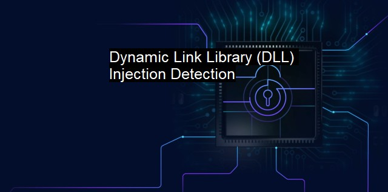
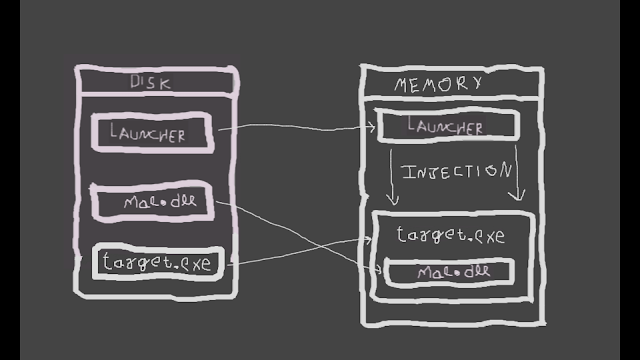
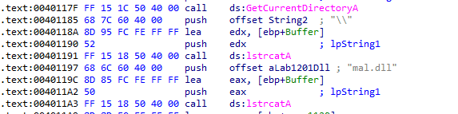
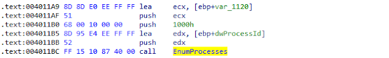
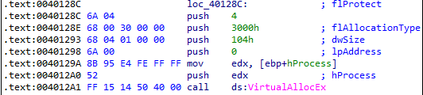
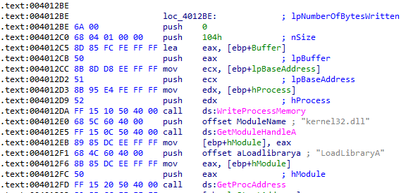

<p align="center">
  
</p>

# Reflective DLL injection Technique

Reflective DLL injection is a library injection technique in which the concept of reflective programming is employed to perform the loading of a library from memory into a host process. As such the library is responsible for loading itself by implementing a minimal Portable Executable (PE) file loader. It can then govern, with minimal interaction with the host system and process, how it will load and interact with the host.

Injection works from Windows NT4 up to and including Windows 8, running on x86, x64 and ARM where applicable.

## Technical Details

The process of remotely injecting a library into a process is two fold. Firstly, the library you wish to inject must be written into the address space of the target process (Herein referred to as the host process). Secondly the library must be loaded into that host process in such a way that the library's run time expectations are met, such as resolving its imports or relocating it to a suitable location in memory.

Assuming we have code execution in the host process and the library we wish to inject has been written into an arbitrary location of memory in the host process, Reflective DLL Injection works as follows.

* Execution is passed, either via CreateRemoteThread() or a tiny bootstrap shellcode, to the library's ReflectiveLoader function which is an exported function found in the library's export table.
* As the library's image will currently exists in an arbitrary location in memory the ReflectiveLoader will first calculate its own image's current location in memory so as to be able to parse its own headers for use later on.
* The ReflectiveLoader will then parse the host processes kernel32.dll export table in order to calculate the addresses of three functions required by the loader, namely LoadLibraryA, GetProcAddress and VirtualAlloc.
* The ReflectiveLoader will now allocate a continuous region of memory into which it will proceed to load its own image. The location is not important as the loader will correctly relocate the image later on.
* The library's headers and sections are loaded into their new locations in memory.
* The ReflectiveLoader will then process the newly loaded copy of its image's import table, loading any additional library's and resolving their respective imported function addresses.
* The ReflectiveLoader will then process the newly loaded copy of its image's relocation table.
* The ReflectiveLoader will then call its newly loaded image's entry point function, DllMain with DLL_PROCESS_ATTACH. The library has now been successfully loaded into memory.
* Finally the ReflectiveLoader will return execution to the initial bootstrap shellcode which called it, or if it was called via CreateRemoteThread, the thread will terminate.

## Build

Open the 'rdi.sln' file in Visual Studio C++ and build the solution in Release mode to make inject.exe and reflective_dll.dll

## Usage


To test use the inject.exe to inject reflective_dll.dll into a host process via a process id, e.g.:

```powershell
> inject.exe 1234
```	

<p align="center">
  
</p>


## What is DLL Injection ?

DLL injection is a process of hiding malicious activity under another legitimate Windows process, which can be considered malware using Windows process as a cloak and avoiding being busted. Malicious software force to load its own DLL which is of course malicious too, and makes it a subprocess of a legitimate, totally usual process’ child process. It can be any process, like svchost.exe or explorer.exe.
For now we know that malware will inject a subprocess under a usual process and try to hide its activity and avoid being busted. But as a foundation we need to know what is DLL exactly, what DLLs stand for. DLL which is short for Dynamic-Link Library is provided by Microsoft for Windows applications to share code among multiple applications. In programming languages we know libraries used for making coding easy and previously defined functions will help us while we are coding; in Windows every program uses need to execute some basic operations and they use DLL for this function. Big operations need basic operations and programs uses pre-defined functions provided by DLL for these actions. We all heard Windows API (Application Programming Interface) before, you can think DLLs are the most basic block of Windows API. For example:

```
kernel32.dll — access and manipulation of files and folders.
gdi32.dll — used for displaying and manipulating graphics.
ntdll.dll — interface to windows kernel.
wsock32.dll — used by Internet and network applications to handle network connections.
```

### In Depth

Malware creates DLL or writes path of malicious DLL inside a remote process using Windows API functions. When target.exe executed, “target.exe” will call the required DLLs from defined paths and load them. By this technique totally normal application will execute “mal.dll” and shows it is a normal subprocess of totally normal application.




As shown in the above picture, we have a launcher file which will be responsible for performing injection of malicious DLL into the target victim executable , mal.dll and target.exe present on the disk. Whenever target.exe is executed, mal.dll is also executed. This technique is a type of covert malware launching technique used for hiding malicious activities inside a legitimate process which is target.exe in our case.

### How it is achieved?

Problem for malware — Process specific firewall, in order to bypass this firewall, there are certain steps to get access to target.exe.

1. Preparing the path of mal.dll <sup>[1](#ref1)</sup>
2. Retrieving PID of target.exe <sup>[2](#ref2)</sup>
3. Obtain handle to the target.exe <sup>[3](#ref3)</sup>
4. Allocate memory inside the [virtual address space](https://docs.microsoft.com/en-us/windows-hardware/drivers/gettingstarted/virtual-address-spaces) of target.exe <sup>[4](#ref4)</sup>
5. Write mal.dll full path at newly created memory in the previous step. <sup>[5](#ref5)</sup>


<a id="ref1"></a>
First, malicious software which we gonna call as the launcher uses [GetCurrentDirectoryA](https://docs.microsoft.com/en-us/windows/win32/api/winbase/nf-winbase-getcurrentdirectory) to get the current working directory and uses [lstrcatA](https://learn.microsoft.com/en-us/windows/win32/api/winbase/nf-winbase-lstrcata) function twice to prepare the path of mal.dll, for example: *C:\Users\user_name\directory\mal.dll*

*Retrieving PID of target.exe*



<a id="ref2"></a>

The next step is to retrieve the process id of target.exe, [EnumProcesses](https://docs.microsoft.com/en-us/windows/win32/api/psapi/nf-psapi-enumprocesses) is a function that retrieves the process identifier for each process object in the system and stores them into an array, after which the launcher can traverse that array and do the string comparison of string “target.exe” with the name of the processes associated with a PID in that array and loop until the correct PID is found.

*Obtain handle to the target.exe*

Once the PID is retrieved, it can be used as a parameter to [OpenProcess](https://docs.microsoft.com/en-us/windows/win32/api/processthreadsapi/nf-processthreadsapi-openprocess) function to obtain a handle to target.exe.



<a id="ref3"></a>

Allocate memory inside the [virtual address space](https://docs.microsoft.com/en-us/windows-hardware/drivers/gettingstarted/virtual-address-spaces) of target.exe

[VirtualAllocEx](https://docs.microsoft.com/en-us/windows/win32/api/memoryapi/nf-memoryapi-virtualallocex) - This function allocates memory inside target.exe using the handle (hProcess) retrieved from the previous step.


<a id="ref4"></a>

*Write mal.dll full path at newly created memory in the previous step*


[Windows API Documantation](https://learn.microsoft.com/en-us/windows/win32/api/)